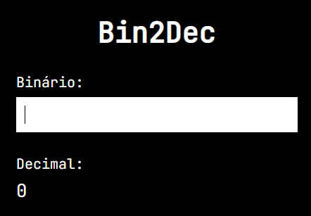

<h1 align="center">Bin2Dec</h1>

## 🔖 Sobre

Aplicação para converter um número na base binária para a base decimal.

 

	

## 💻 Tecnologias

Esse projeto foi desenvolvido com as seguintes tecnologias:

- [React](https://pt-br.reactjs.org/)
- [TypeScript](https://www.typescriptlang.org/)
- [Vite](https://vitejs.dev/)

---

Desenvolvido por Tiago Faria.