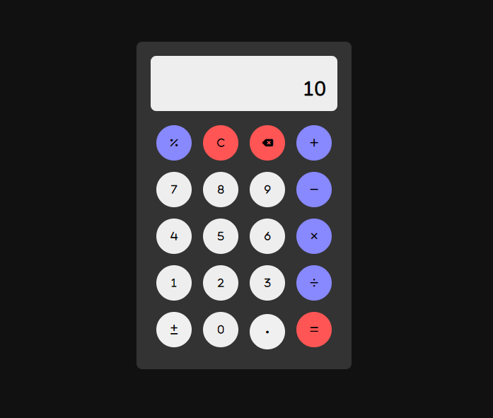

<h1 align="center">Calculator</h1>

## 🔖 Sobre

Calculadora simples, para realizar operações de: soma, subtração, multiplicação e divisão.

 

  

## 💻 Tecnologias

Esse projeto foi desenvolvido com as seguintes tecnologias:

- [React](https://pt-br.reactjs.org/)
- [TypeScript](https://www.typescriptlang.org/)
- [Vite](https://vitejs.dev/)

---

Desenvolvido por Tiago Faria.